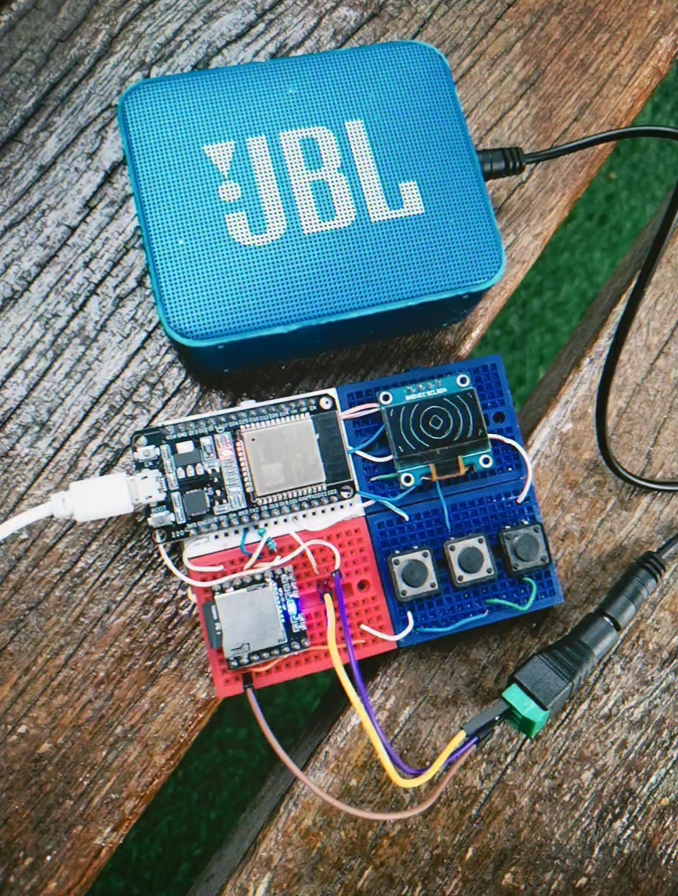

# ESP32 Minecraft Jukebox

A desktop jukebox built around an ESP32: it plays all 54 tracks from C418's
*Minecraft Volume Alpha & Beta* off a microSD card, shows the title and
author (or an animation) on a little OLED screen, and is controlled
entirely with three buttons.

<p align="center">
  
</p>

> [!NOTE]
> Sorry
> I didn't know that the code by AI need to be less than 30%
> i'm rewriting all the project to comply with the rules

## Story

I had already built an mp3 player with a DFPlayer Mini, and thought: why not
turn it into a Minecraft jukebox? So I wired up the whole circuit and got the
project set up in PlatformIO, and started thinking about drawing Minecraft
animations on the OLED screen. More updates soon as it comes together.

## What this is

It boots on its own: power it on, a loading bar fills up on screen, and it's
already playing. You don't have to touch anything to start listening — the
buttons are for skipping tracks, browsing the full song list, adjusting
volume, and picking which animation shows while it plays.

## Hardware

| Signal         | ESP32 pin     | Notes                                |
|----------------|---------------|----------------------------------------|
| OLED SDA       | GPIO21        | default I2C                            |
| OLED SCL       | GPIO22        | default I2C                            |
| DFPlayer RX    | GPIO17 (TX2)  | with a 1kΩ series resistor             |
| DFPlayer TX    | GPIO16 (RX2)  |                                         |
| DFPlayer VCC   | 5V            | shared GND with the rest of the circuit|
| Prev button    | GPIO32        | `INPUT_PULLUP`, active low             |
| Select button  | GPIO25        | `INPUT_PULLUP`, active low             |
| Next button    | GPIO33        | `INPUT_PULLUP`, active low             |

Modules: ESP32 DevKit, SSD1306 128×64 I2C OLED display, DFPlayer Mini +
microSD card (FAT32), 3 push buttons.

## Build and flash

With [PlatformIO](https://platformio.org/) installed:

```bash
pio run                 # build
pio run -t upload       # flash the ESP32 (port auto-detected)
pio device monitor      # serial log, handy if something doesn't boot
```

On Linux, if the USB port isn't detected, add your user to the `dialout`
group (`sudo usermod -aG dialout $USER`) and log back in.

## Controls

- **While playing:**
  - `Select` short press = pause/resume.
  - `Select` held = opens the song list.
  - `Next`/`Prev` short press = next/previous track.
  - `Next`/`Prev` held = volume up/down.
- **Song list:**
  - `Next`/`Prev` = scroll the list.
  - `Select` short press = play the highlighted song.
  - `Select` held = jump to the animation picker.
- **Animation picker:**
  - `Next`/`Prev` = try out animations (live preview, with a `3/11`-style counter).
  - `Select` short press = confirm and go back to playing.
  - `Select` held = back to the song list.
- Leave either menu untouched for 6 seconds and it closes on its own back to
  the playing screen.

## The songs

The 54 tracks are C418's full album (Alpha + Beta), defined in
[`include/tracks.h`](include/tracks.h). The mp3 files themselves aren't in
this repo — you need to put them on the microSD yourself (see below). By
default it plays in shuffle mode with history: `Prev` always takes you back
to the actual previous track, not another random one.

## Animations

There are 11 animations available: 2 drawn in code (a spinning disc and a
bouncing note) and 9 bitmap ones, generated with the
[OLED Bitmap Generator](https://www.oledanimationmaker.com/) and stored in
[`include/animation_bitmaps.h`](include/animation_bitmaps.h). They're picked
by hand from the animation menu, and the choice stays fixed until you change
tracks or open the menu again (it doesn't reset on its own).

The boot screen also uses a real bitmap (a loading bar that fills up frame
by frame and disappears once it's full), in
[`include/boot_bitmap.h`](include/boot_bitmap.h).

## Preview mode

`PREVIEW_MODE` in `config.h` (off by default) sets up a fixed intro for
showing off the project: it boots straight into *Chirp* with animation #11,
the next track is *Moog City 2*, and after that it continues in normal
shuffle mode (every new track gets a different random animation, with that
pairing kept in history too).

## Configuration

Everything tunable (pins, timing, shuffle mode, animation mode, preview
mode) is centralized in [`include/config.h`](include/config.h) — nothing
else needs to change to adjust that behavior.

## Adding your own songs

The DFPlayer Mini expects the files numbered at the microSD root:
`0001.mp3`, `0002.mp3`, `0003.mp3`, and so on, with no gaps.

1. Copy your mp3s to the microSD renamed in that format.
2. Edit [`include/tracks.h`](include/tracks.h) so the `TRACKS` list matches
   the order and count of what you put on the card (title, author, and file
   number).
3. Rebuild and flash the firmware (`pio run -t upload`).
4. Commit the change to `tracks.h`:
   ```bash
   git add include/tracks.h
   git commit -m "Update tracklist"
   git push
   ```
   (the mp3s themselves don't get pushed to the repo, just the record of
   which song is which number).

## Project structure

```
include/
  config.h            centralized configuration
  tracks.h            song list (title, author, file number)
  animations.h        animation system API and modes
  animation_bitmaps.h frames for the 9 bitmap animations
  boot_bitmap.h        frames for the boot loading bar
  buttons.h / player.h / display.h
src/
  main.cpp            state machine and button logic
  animations.cpp / display.cpp / buttons.cpp / player.cpp
```

## What's mine and what's AI

I used Claude Code to write the ESP32 firmware (the state machine, buttons,
menus, animation system) and to wire in the animations. Everything else —
coming up with the idea, sourcing and wiring the hardware, assembling the
circuit, and testing it for real — I did myself.

## Credits

The music is by **C418** (*Minecraft Volume Alpha & Beta*) — this project
doesn't include or redistribute it, it's for personal use only. Thanks to
Adafruit for the OLED/GFX libraries and to DFRobot for the DFPlayer Mini.

---
*SantiagortegaDev* with *Claude*
